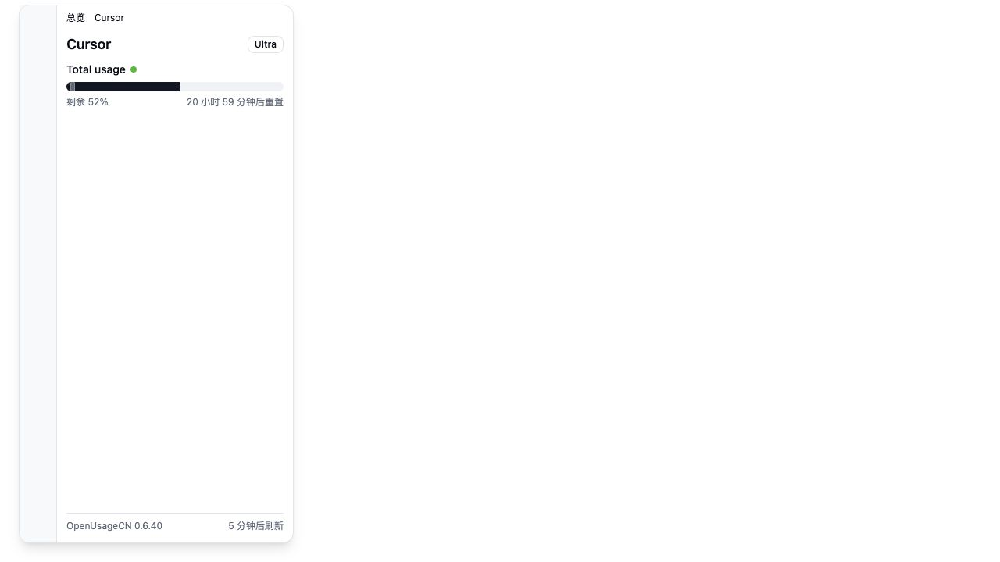
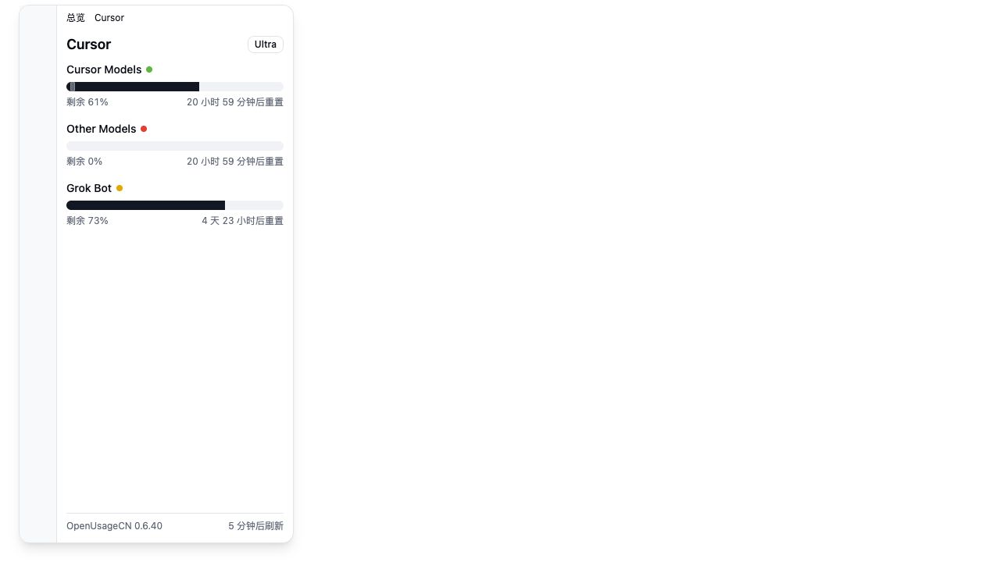
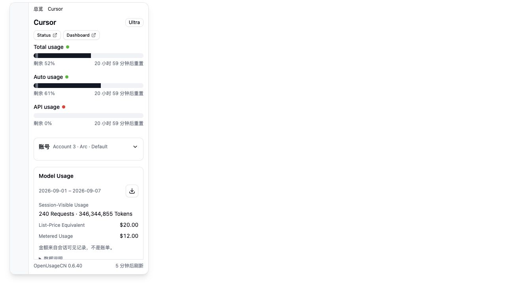
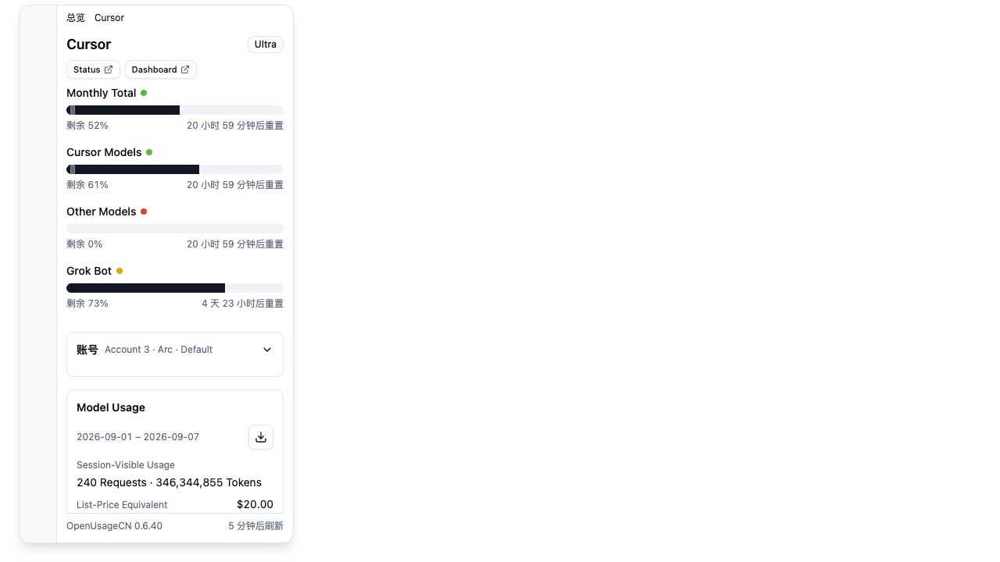

# Cursor Quota Screenshots

Captured on 2026-09-16 with the real React page components, production CSS and synthetic provider/account data in a browser preview. These are layout checks, not live Cursor API or packaged Tauri verification.

Before uses the overview/detail pages and Cursor manifest from `19a36a2`; shared components are unchanged by this branch. After uses the updated pages and manifest. Both use the same 690 px panel, monthly usage values and account/model fixtures. Only After includes the new independent Grok Bot fixture (27% used, five days until reset).

| Page | Before | After |
| --- | --- | --- |
| Overview |  |  |
| Cursor |  |  |
